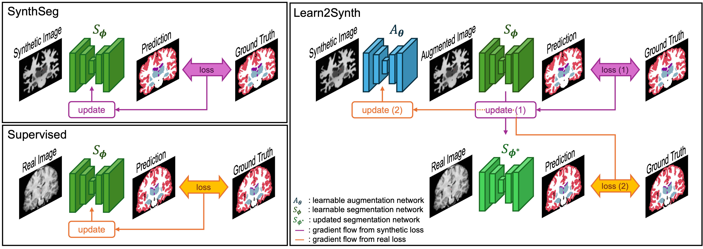

# Learn2Synth
[*Learn2Synth*: Learning Optimal Data Synthesis using Hypergradients for Brain Image Segmentation](https://arxiv.org/pdf/2411.16719)

### Framework

<p align="center">
  
</p>

### Script to run the experiments:

```
ALPHA=1
try=1
OUTDIR="folder/experiment_noise_${ALPHA}_${try}"

cd scripts/

rm -rf $OUTDIR
mkdir $OUTDIR
python train_noise.py fit \
  --trainer.max_epochs 60000 \
  --model.ndim 2 \
  --data.ndim 2 \
  --trainer.default_root_dir $OUTDIR \
  --trainer.accelerator gpu \
  --trainer.devices 1 \
  --data.num_workers 4 \
  --model.classic true \
  --model.real_sigma_min 0 \
  --model.real_sigma_max 0 \
  --model.alpha $ALPHA \
  --model.loss logitmse \
  --model.optimizer_options "{'lr': 0.001}"

```

# Citation
If you found this repository useful, please consider citing our paper:
```bibtex
@inproceedings{hu2025learn2synth,
  title={Learn2Synth: Learning Optimal Data Synthesis using Hypergradients for Brain Image Segmentation},
  author={Hu, Xiaoling and Zeng, Xiangrui and Puonti, Oula and Iglesias, Juan Eugenio and Fischl, Bruce and Balbastre, Ya{\"e}l},
  booktitle={ICCV},
  year={2025},
}