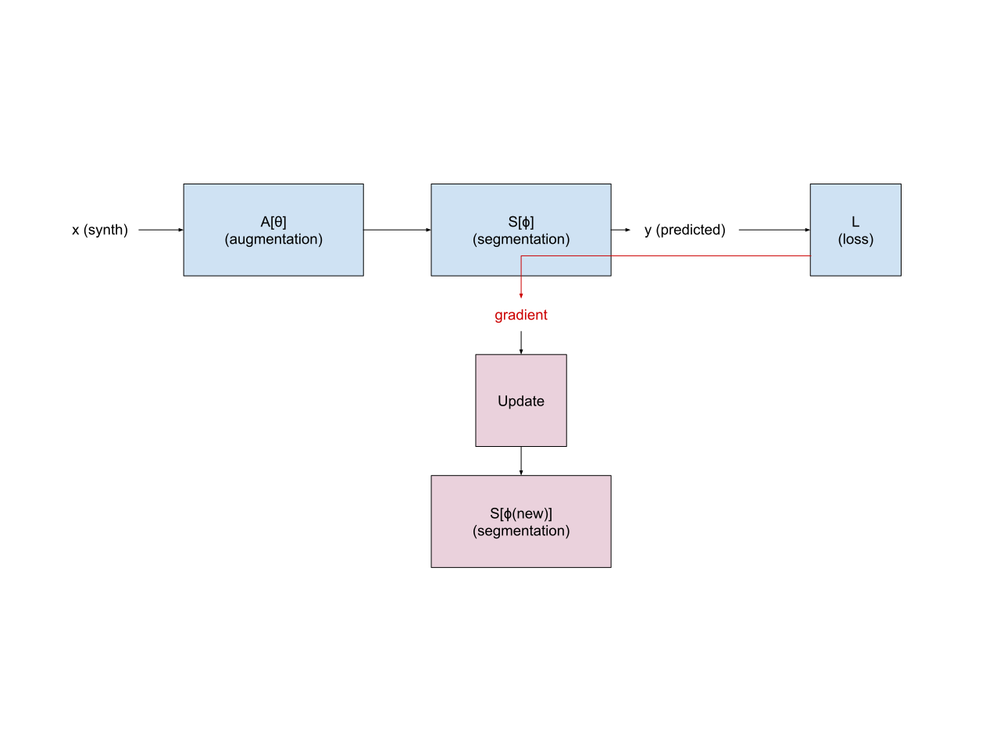
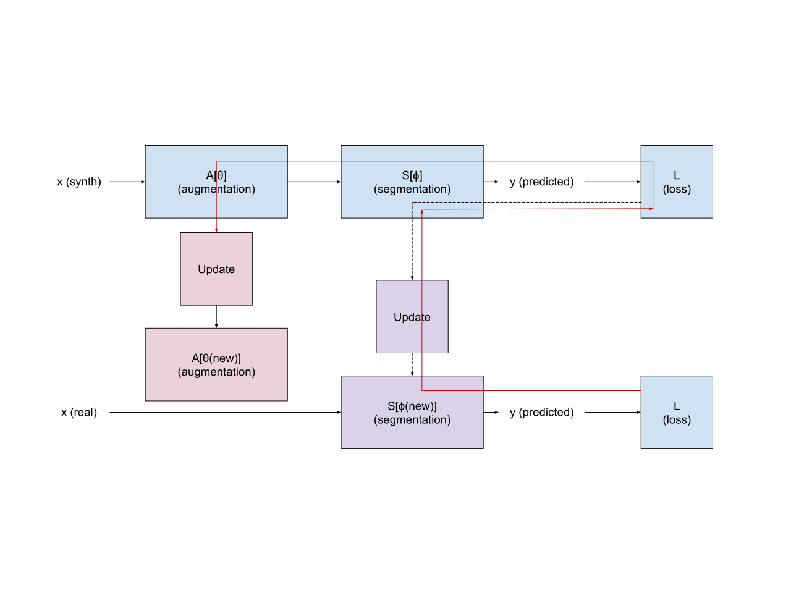

# Learn2Synth

On one hand, domain randomization through synthesis (e.g., SynthSeg, SynthSR, SynthMorph, SynthStrip) is an extremely powerful strategy to 
train contrast-agnostic networks in a data scarce context. Randomization allows networks to see an infinite range of intensities and artifacts 
during training, thereby minimizing overfitting and maximizing generalization to out-of-sample data. On the other hand, this type of augmentation 
relies on ad hoc rules, which limits the range of shapes and artifacts that can be generated. When a small number of labeled data is available, 
it may be beneficial for the network to gain information from them as well. A simple strategy consists of augmenting the synthetic training set 
with a few real images, sampled under a predefined proportion. However, a risk is that the network filters get learned directly from the real 
images and therefore overfit to the small number of structures that they contain. A more elegant alternative is to use the real data to make the 
synthesis procedure more realistic – or at least bias the synthesis such that the trained network works best on real data.

We design a training procedure, in which synthetic training examples generated under ad-hoc rules are augmented by a trainable network. 
The augmented synthetic data is then used to train a segmentation network. Rather than using a loss that aims to make the synthetic data look more 
like real data (e.g., contrastive or adversarial), which carry the risk of unpairing the image and its label map, we use a loss that incites the 
augmentation network to generate samples that better train the segmentation network. This allows the training procedure to benefit from real 
labeled examples, without ever using these real examples to train the segmentation network. Our procedure is shown in Fig 1.

In practice:
1. we freeze the augmentation network and update the segmentation network when running a “synthetic” training step, 
and
2. we freeze the segmentation network and update the augmentation network when running the “real” training step.

If implemented naively, no gradients flow into the augmentation network when running the “real” step (since the real image does not pass
through the augmentation network). To make this strategy effective, we implement a differentiable update step, such that the augmentation 
network is encouraged to generate synthetic images that cause a better update of the segmentation network.

---
**Step 1: synthetic pass and update segmentation network**

**Step 2: synthetic pass and update segmentation network**

**Figure 1.** Two-pass training procedure. The data flow is depicted with black arrows, and the gradient flow is depicted with red arrows. 
In the first pass, a synthetic image is augmented and segmented, and the resulting loss is used to update the weights of the segmentation network. 
In the second pass, the computational graph of the previous update is preserved. A real image is then segmented and its loss computed. 
Its gradient flows through the previous update step, and through the previous synthetic forward pass. This gradient flow is used to update 
the weights of the augmentation network.

---

Mathematically, let $\left(x_{\text{real}}, y_{\text{real}}\right)$ and $\left(x_{\text{synth}}, y_{\text{synth}}\right)$  be real and synthetic labeled examples. 
Let $A_{\boldsymbol\theta}$ and $S_{\boldsymbol\phi}$ be the augmentation and segmentation networks, with respective weights $\boldsymbol\theta$ and $\boldsymbol\phi$. 

The forward pass applied to the synthetic data is
$$\ell_{\text{synth}} = \mathcal{L}\left( S_{\boldsymbol\phi} \circ A_{\boldsymbol\theta} (x_{\text{synth}}), y_{\text{synth}} \right)$$

where $\mathcal{L}$ is the loss _function_ and $\ell$ is the loss _value_. We can compute the gradient of this loss with respect to the segmentation network’s weights:
$$g_{\boldsymbol\phi} = \frac{\partial\ell_{\text{synth}}}{\partial\boldsymbol\phi},$$ 
which we use to update the network through the update step
$$\boldsymbol\phi_{\text{new}} = \text{update}(\boldsymbol\phi, g_{\boldsymbol\phi}).$$

This update is followed by a forward pass applied to the real data, i.e., 
$$\ell_{\text{real}} = \mathcal{L}\left( S_{\boldsymbol\phi_{\text{new}}}(x_{\text{real}}), y_{\text{real}} \right).$$
The gradient of this loss with respect to the augmentation network is 
$$g_{\boldsymbol\theta} 
= \frac{\partial\ell_{\text{real}}}{\partial\boldsymbol\theta} 
= \frac{\partial\ell_{\text{real}}}{\partial\boldsymbol\phi_{\text{new}}} \times \frac{\partial\boldsymbol\phi_{\text{new}}}{\partial g_{\boldsymbol\phi}} \times \frac{\partial g_{\boldsymbol\phi}}{\partial\boldsymbol\theta}
= \frac{\partial\ell_{\text{real}}}{\partial\boldsymbol\phi_{\text{new}}} \times \frac{\partial\boldsymbol\phi_{\text{new}}}{\partial g_{\boldsymbol\phi}} \times \frac{\partial^2\ell_{\text{synth}}}{\partial\boldsymbol\phi\partial\boldsymbol\theta^T}
,
$$ 
which we use to update the network through the update step
$$\boldsymbol\theta_{\text{new}} = \text{update}(\boldsymbol\theta, g_{\boldsymbol\theta}).$$

There are three terms in the computation of g:
1. $\frac{\partial\ell_{\text{real}}}{\partial\boldsymbol\phi_{\text{new}}}$ is the gradient of the (real) loss with respect to the current weights of the segmentation network. If we were doing a classic training using real data, that’s what we would use to update the segmentation network’s weights.
2. $\frac{\partial\boldsymbol\phi_{\text{new}}}{\partial g_{\boldsymbol\phi}}$ is the gradient of the update step with respect to the previous gradient. If the update step is a simple gradient descent step, that term is $-\varepsilon \mathbf{I}$, where $\varepsilon$ is the learning rate and $\mathbf{I}$ is an identity matrix.
3. $\frac{\partial^2\ell_{\text{synth}}}{\partial\boldsymbol\phi\partial\boldsymbol\theta^T}$ is the hessian of the (synthetic) loss with respect to the segmentation and augmentation networks. It tells us how the synthetic loss changes when we take a step in both $\boldsymbol\phi$ and $\boldsymbol\theta$.
